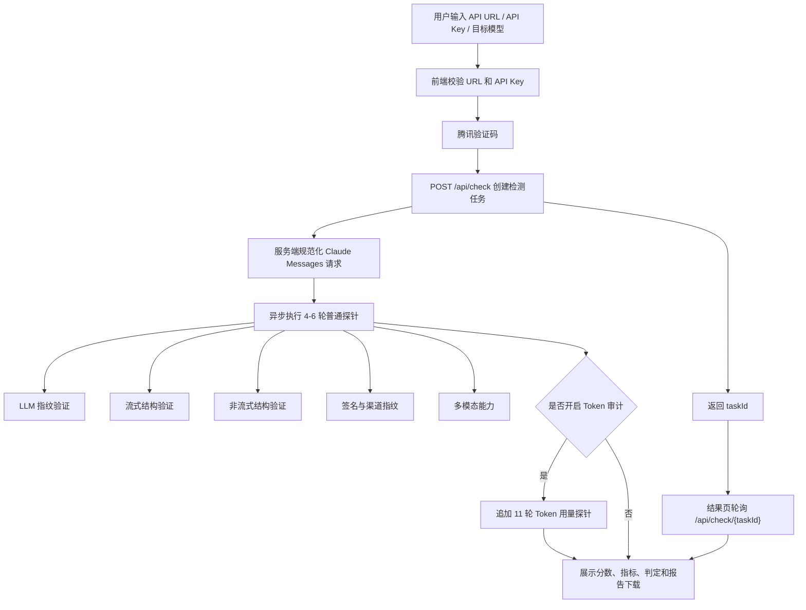

# CCTest.ai 测试原理调研与伪代码

调研日期：2026-05-21

## 1. 调研目标

本文用于梳理 `cctest.ai` 的公开检测流程、测试原理、评分口径和可复刻实现方式，为 CheapAI 后续“中转站真实性检测 / 反掺假检测 / Token 用量审计”提供产品和技术参考。

重要边界：

1. 本文只基于公开网页、前端静态资源和 Claude 官方 API 文档调研。
2. 没有向 CCTest 提交真实 API Key，也没有调用任何中转站生产接口。
3. CCTest 服务端的真实探针题库、签名解析规则和判定阈值不可见，本文中的服务端算法为“可实现推断”，不是对其私有实现的还原。
4. `signature` 在 Anthropic 官方文档中被定义为 opaque 字段，不建议业务系统解释或解析。CCTest FAQ 声称会解析 Protobuf 签名，因此本文把签名解析视为检测型黑盒能力，不应作为唯一判定依据。

## 2. 资料来源与证据等级

### 2.1 公开页面

1. CCTest 首页：`https://cctest.ai/zh`
   - 输入项：API 接口地址、API Key、目标模型。
   - 支持模型：`Sonnet 4.6`、`Opus 4.6`、`Opus 4.7`。
   - 可选项：检测 Token 使用量是否异常，页面提示会发送 11 轮测试请求，预计消耗约 `$0.3`。
   - 页面文案强调建议使用测试专用 API Key，并声称工具不会存储 API Key。

2. CCTest FAQ：`https://cctest.ai/zh/faq`
   - 定位：判断 API 中转站是否稳定转发真实模型接口，或存在包装、伪装、协议不一致、能力掺水。
   - 方法：多轮探测请求，交叉判断接口返回结构、知识表现、身份一致性、思维链痕迹和签名指纹。
   - 核心检测：LLM 指纹验证、流结构完整性、非流结构完整性、签名校验、多模态能力。
   - 请求成本：普通检测约 4-6 次请求，约 200-500 输入 tokens 和 500-1500 输出 tokens。

### 2.2 前端静态资源可观察信息

从 `cctest.ai` 首页静态 chunk 可观察到：

1. 前端会把用户输入的接口地址规范化为 `/v1/messages`：
   - 如果输入地址已经以 `/v1/messages` 结尾，则直接使用。
   - 否则去掉结尾 `/` 后追加 `/v1/messages`。

2. 创建检测任务的请求形态：

```ts
POST /api/check
Content-Type: application/json

{
  url: normalizedMessagesUrl,
  apiKey: apiKey,
  model: "claude-sonnet-4-6" | "claude-opus-4-6" | "claude-opus-4-7",
  checkTokenUsage: boolean,
  ticket: tencentCaptchaTicket,
  randstr: tencentCaptchaRandstr,
  locale: locale
}
```

3. 创建成功后跳转到：

```text
/{locale}/result/{taskId}
```

4. 结果页每 1.5 秒轮询：

```ts
GET /api/check/{taskId}
```

5. 结果页公开的评分维度和权重：

| 维度 | 字段 | 权重 |
| --- | --- | ---: |
| LLM 指纹验证 | `tag_check` | 10 |
| 结构完整性 | `structure` | 20 |
| 行为验证 | `behavior` | 30 |
| 签名校验 | `signature_proto` | 30 |
| 多模态能力 | `multimodal` | 10 |

总分 100。页面按总分显示圆环，`>=90` 蓝色、`>=70` 橙色、低于 70 红色。

6. 结果判定枚举：

| `verdictKey` | 含义 |
| --- | --- |
| `official` | 官方 Claude，页面文案指向 Claude Max / 官方 Console |
| `official_flawed` | 是 Claude，但结构存在瑕疵 |
| `unofficial` | 是 Claude，但来自非官方渠道 |
| `reversed` | 是 Claude 模型，可能从其他平台逆向 |
| `not_claude` | 非 Claude，疑似其他模型冒充 |

7. 渠道字段：

```ts
streamChannel: "anthropic" | "aws-bedrock" | "vertex" | string
nonStreamChannel: "anthropic" | "aws-bedrock" | "vertex" | string
hasVertex: boolean
```

8. Token 用量审计：
   - 可选。
   - 结果页会展示 11 轮审计进度。
   - 前端包含三组 11 轮官方基线数组，按目标模型选择：
     - `expectedModel` 包含 `sonnet`：使用 Sonnet 4.6 基线。
     - `expectedModel` 包含 `opus-4-7` 或 `opus-4.7`：使用 Opus 4.7 基线。
     - 其他：使用 Opus 4.6 基线。
   - 每轮基线字段：`i` 输入 tokens、`o` 输出 tokens、`cw` cache write tokens、`cr` cache read tokens。
   - 页面展示字段：实际消耗、官方基线、倍率、缓存命中率。
   - UI 阈值：
     - 总体倍率 `<= 1.2x`：正常。
     - 总体倍率 `<= 1.5x`：偏高。
     - 总体倍率 `> 1.5x`：异常。
     - 缓存命中率 `>= 60%`：较好。
     - 缓存命中率 `>= 30%`：一般。
     - 缓存命中率 `< 30%`：差。

### 2.3 Claude 官方协议依据

1. Claude Messages Streaming 官方事件流：
   - `message_start`
   - `content_block_start`
   - 一个或多个 `content_block_delta`
   - `content_block_stop`
   - 一个或多个 `message_delta`
   - `message_stop`
   - 期间可以穿插 `ping`

2. Thinking / Signature 官方行为：
   - 扩展思考会返回 `thinking` content block 和 `signature`。
   - 流式响应里，`signature_delta` 会在 `content_block_stop` 前通过 `content_block_delta` 出现。
   - 官方明确说明 `signature` 是 opaque 字段，不应解释或解析。
   - 但 CCTest FAQ 声称其会“解析 Protobuf 签名，识别渠道来源”，因此这是它区别于普通结构检测的高权重黑盒检测点。

3. 多模态：
   - Claude 支持图片输入，Messages API 中图片可以以 base64、URL 或 Files API 引用形式出现。
   - CCTest FAQ 声称会测试图片和文档识别能力，因此多模态探针可验证中转站是否完整透传 Claude 能力。

## 3. CCTest 的整体检测流程推断



## 4. 关键检测原理

## 4.1 LLM 指纹验证

目标：判断返回内容是否像 Claude，而不是 GLM、MiniMax、Codex、OpenAI 或其他模型伪装。

可能手段：

1. 使用 Claude 系模型特有的能力题、风格题、协议题、拒答边界题进行组合测试。
2. 不依赖“你是谁”这类自我声明，因为模型可以被系统提示词诱导自称 Claude。
3. 关注模型对结构化约束、长上下文细节、代码推理、边界安全策略、工具调用语义的综合表现。
4. 对输出做机器判分，而不是人工阅读：
   - 是否满足精确 JSON schema。
   - 是否命中预期事实。
   - 是否出现非 Claude 典型口癖或系统提示泄漏。
   - 是否拒绝/遵循的边界与 Claude 接近。

建议在 CheapAI 中实现时把 LLM 指纹作为“中低权重证据”。它能发现低级冒充，但不能单独证明官方来源。

## 4.2 流结构完整性

目标：验证中转站是否完整透传 Claude 官方 SSE 事件序列。

高价值信号：

1. 事件顺序是否符合 Claude Messages Streaming。
2. `message_start.message` 是否包含基础字段。
3. `content_block_start`、`content_block_delta`、`content_block_stop` 的 `index` 是否连续一致。
4. `message_delta.usage` 是否累计输出 tokens。
5. `message_stop` 是否正常结束。
6. 是否存在 OpenAI SSE 格式混入，例如 `choices[].delta`、`[DONE]` 等。
7. 是否截断 thinking、signature、usage 或 stop reason。

常见造假表现：

1. 用 OpenAI 兼容层包 Claude，SSE 结构变成 OpenAI 格式。
2. 只转发文本，不转发 thinking/signature/usage。
3. 非法拼装事件顺序。
4. 流式和非流式返回渠道不一致。

## 4.3 非流结构完整性

目标：验证普通 JSON 响应是否符合 Claude Messages API 形态。

检查点：

1. 顶层字段：`id`、`type`、`role`、`model`、`content`、`stop_reason`、`usage`。
2. `role` 应为 `assistant`。
3. `content` 应为 block 数组，不是纯字符串。
4. text block、thinking block、redacted thinking block 的字段完整性。
5. `usage` 中输入、输出、缓存相关字段是否存在且数值合理。
6. 响应中的 `model` 是否与请求模型或预期模型兼容。

## 4.4 签名校验与渠道识别

目标：识别响应是否具有 Claude thinking signature，并尝试从签名或相关协议痕迹中判断渠道来源。

CCTest FAQ 明确提到：

1. 会解析 Protobuf 签名。
2. 会识别 `aws-bedrock`、`vertex` 等渠道。
3. 签名校验异常时可能判定为低级逆向渠道。
4. LLM 指纹验证失败时会判定为非 Claude。

可实现思路：

1. 触发 thinking 或 adaptive thinking，让 Claude 返回 thinking/signature 相关 block。
2. 同时做流式和非流式请求，分别提取 signature。
3. 对 signature 做存在性、长度、base64 格式、事件位置和多轮稳定性检查。
4. 如果有私有签名解析能力，可解析 envelope/version/issuer/channel 等字段。
5. 如果没有解析能力，不应伪造“渠道识别”，只能做签名形态完整性检测。

风险：

1. Anthropic 官方明确说 signature 是 opaque 字段，不保证可解析。
2. 签名格式可能随模型版本、云平台和 API 行为变化。
3. 解析签名应封装为独立模块，失败时降级为“不确定”，不能导致整体检测崩溃。

## 4.5 多模态能力检测

目标：验证中转站是否支持 Claude 的图片/文档输入能力，而不是只支持文本补全。

探针建议：

1. 图片中嵌入短文本、数字或几何关系，要求模型返回严格 JSON。
2. 文档或图片题应低成本、可自动判分。
3. 避免人脸识别、医疗诊断、敏感图片等高风险内容。
4. 记录失败类型：
   - 不支持 image block。
   - 请求体被中转站过滤。
   - 返回纯文本但答案错误。
   - 上游格式转换导致 token/延迟异常。

## 4.6 Token 用量审计

目标：验证中转站是否存在扣费倍率异常、缓存未命中、Token 统计伪造或隐藏加价。

CCTest 的可观察机制：

1. 开启后发送 11 轮请求。
2. 与模型对应的官方基线 token 数对比。
3. 使用字段包括：
   - `input_tokens`
   - `output_tokens`
   - `cache_creation_input_tokens`
   - `cache_read_input_tokens`
4. 展示官方基线成本、实际成本、总体倍率、缓存命中率。

可实现逻辑：

1. 固定一组可缓存的系统提示词和工具定义。
2. 第一轮触发 cache write。
3. 后续多轮复用相同前缀，观察 cache read。
4. 按官方价格表计算理论成本。
5. 与实际返回 usage 计算的成本对比。
6. 如果实际成本显著高于基线，标记“用量偏高 / 异常”。

## 5. 判定模型

建议 CheapAI 不要只输出“真假”，应输出证据链：

| 判定 | 条件示例 | 风险等级 |
| --- | --- | --- |
| 官方 Claude | 指纹通过、结构完整、签名渠道为 Anthropic、流/非流一致、多模态通过 | 低 |
| Claude 但结构瑕疵 | 指纹通过、签名可用，但流/非流结构字段缺失 | 中低 |
| 非官方 Claude 渠道 | 指纹通过，但签名渠道为 AWS Bedrock / Vertex 或其他非 Anthropic | 中 |
| 疑似逆向 Claude | 指纹通过，但签名缺失/异常，协议存在逆向痕迹 | 中高 |
| 非 Claude | 指纹失败，结构不符合 Claude，或行为明显属于其他模型 | 高 |

## 6. 数据结构伪代码

```ts
type CheckStatus = "pending" | "running" | "done" | "error";

type VerdictKey =
  | "official"
  | "official_flawed"
  | "unofficial"
  | "reversed"
  | "not_claude"
  | "unknown";

type Channel = "anthropic" | "aws-bedrock" | "vertex" | "unknown" | "invalid";

type ScoreKey =
  | "tag_check"
  | "structure"
  | "behavior"
  | "signature_proto"
  | "multimodal";

type CheckTask = {
  id: string;
  status: CheckStatus;
  step: number;
  progress: number;
  expectedModel: string;
  responseModel?: string;
  checkTokenUsage: boolean;
  scores: Record<ScoreKey, number>;
  total: number;
  verdictKey?: VerdictKey;
  streamChannel?: Channel;
  nonStreamChannel?: Channel;
  hasVertex?: boolean;
  metrics?: {
    latencyMs: number;
    tokensPerSec: number;
    inputTokens: number;
    outputTokens: number;
  };
  tokenAudit?: TokenAuditReport;
  tokenAuditPartial?: TokenAuditRow[];
  tokenAuditProgress?: string;
  error?: string;
};

type TokenAuditRow = {
  round: number;
  input_tokens: number;
  output_tokens: number;
  cache_creation_input_tokens: number;
  cache_read_input_tokens: number;
  cost: number;
  baseline_cost: number;
  ratio: number;
};

type TokenAuditReport = {
  rows: TokenAuditRow[];
  totalCost: number;
  baselineTotalCost: number;
  overallRatio: number;
  cacheHitRate: number;
};
```

## 7. 创建任务伪代码

```ts
async function createCheckTask(input: CreateCheckInput): Promise<{ taskId: string }> {
  assertValidUrl(input.apiUrl);
  assertNonEmpty(input.apiKey);
  assertAllowedModel(input.model);
  await verifyCaptcha(input.ticket, input.randstr);

  const targetUrl = normalizeClaudeMessagesUrl(input.apiUrl);
  const task = await taskStore.create({
    status: "pending",
    expectedModel: input.model,
    checkTokenUsage: input.checkTokenUsage,
    scores: emptyScores(),
    total: 0,
    progress: 0,
  });

  // 安全要求：API Key 只进入短生命周期执行上下文。
  // 不落库、不写日志、不进入错误消息、不进入任务持久化字段。
  jobQueue.enqueue({
    taskId: task.id,
    targetUrl,
    apiKeyRef: secretVault.putEphemeral(input.apiKey, ttlMinutes = 15),
    model: input.model,
    checkTokenUsage: input.checkTokenUsage,
  });

  return { taskId: task.id };
}

function normalizeClaudeMessagesUrl(apiUrl: string): string {
  const trimmed = apiUrl.replace(/\/+$/, "");
  if (trimmed.endsWith("/v1/messages")) return trimmed;
  return `${trimmed}/v1/messages`;
}
```

## 8. 检测 Runner 伪代码

```ts
async function runCheckJob(job: CheckJob): Promise<void> {
  const apiKey = await secretVault.get(job.apiKeyRef);

  try {
    await taskStore.markRunning(job.taskId);

    const context: CheckContext = {
      targetUrl: job.targetUrl,
      apiKey,
      model: job.model,
      evidence: [],
    };

    updateStep(job.taskId, 0, "LLM 指纹验证");
    const tagResult = await runLlmFingerprintProbe(context);

    updateStep(job.taskId, 1, "结构完整性");
    const streamResult = await runStreamStructureProbe(context);
    const nonStreamResult = await runNonStreamStructureProbe(context);
    const structureResult = mergeStructureResults(streamResult, nonStreamResult);

    updateStep(job.taskId, 2, "行为验证");
    const behaviorResult = await runBehaviorProbe(context);

    updateStep(job.taskId, 3, "签名校验");
    const signatureResult = await runSignatureProbe(context, streamResult, nonStreamResult);

    updateStep(job.taskId, 4, "多模态能力");
    const multimodalResult = await runMultimodalProbe(context);

    const scores = {
      tag_check: scoreTag(tagResult),
      structure: scoreStructure(structureResult),
      behavior: scoreBehavior(behaviorResult),
      signature_proto: scoreSignature(signatureResult),
      multimodal: scoreMultimodal(multimodalResult),
    };

    let tokenAudit: TokenAuditReport | undefined;
    if (job.checkTokenUsage) {
      updateStep(job.taskId, 5, "Token 用量审计");
      tokenAudit = await runTokenUsageAudit(context, row => {
        taskStore.update(job.taskId, {
          tokenAuditPartial: appendRow(row),
          tokenAuditProgress: `${row.round}/11`,
        });
      });
    }

    const verdict = classifyVerdict({
      tagResult,
      structureResult,
      behaviorResult,
      signatureResult,
      multimodalResult,
      scores,
    });

    await taskStore.update(job.taskId, {
      status: "done",
      step: job.checkTokenUsage ? 6 : 5,
      progress: 100,
      scores,
      total: sumScores(scores),
      verdictKey: verdict.key,
      streamChannel: signatureResult.streamChannel,
      nonStreamChannel: signatureResult.nonStreamChannel,
      hasVertex: signatureResult.hasVertex,
      responseModel: context.responseModel,
      metrics: aggregateMetrics(context.evidence),
      tokenAudit,
    });
  } catch (error) {
    await taskStore.update(job.taskId, {
      status: "error",
      error: sanitizeError(error),
    });
  } finally {
    await secretVault.delete(job.apiKeyRef);
  }
}
```

## 9. 流结构检测伪代码

```ts
async function runStreamStructureProbe(ctx: CheckContext): Promise<StreamProbeResult> {
  const startedAt = now();
  const response = await postClaudeMessage(ctx, {
    stream: true,
    messages: buildStructureProbeMessages(),
    thinking: buildThinkingConfig(ctx.model),
  });

  assert(response.status === 200);
  assertHeaderContains(response, "content-type", "text/event-stream");

  const events = await parseSse(response.body);
  const state = new StreamStateMachine();
  const signatures: string[] = [];

  for (const event of events) {
    if (event.name === "ping") continue;

    state.accept(event);

    if (event.name === "message_start") {
      validateMessageStart(event.data.message);
      ctx.responseModel = event.data.message.model;
    }

    if (event.name === "content_block_delta") {
      const delta = event.data.delta;
      if (delta.type === "signature_delta") {
        signatures.push(delta.signature);
      }
      if (delta.type === "input_json_delta") {
        state.appendPartialJson(event.data.index, delta.partial_json);
      }
    }

    if (event.name === "message_delta") {
      validateUsageIsCumulative(event.data.usage);
      state.captureStopReason(event.data.delta.stop_reason);
    }
  }

  state.assertCompleteEventFlow();
  state.assertContentBlocksClosed();
  state.assertFinalMessageStop();

  return {
    ok: true,
    latencyMs: elapsedMs(startedAt),
    signatures,
    channel: inferChannelFromSignatures(signatures),
    usage: state.finalUsage,
    anomalies: state.anomalies,
  };
}

class StreamStateMachine {
  accept(event: SseEvent): void {
    switch (event.name) {
      case "message_start":
        requireCurrentPhase("init");
        phase = "message_started";
        break;
      case "content_block_start":
        requirePhaseAtLeast("message_started");
        openBlock(event.data.index);
        break;
      case "content_block_delta":
        requireBlockOpen(event.data.index);
        break;
      case "content_block_stop":
        closeBlock(event.data.index);
        break;
      case "message_delta":
        requireNoOpenBlocks();
        phase = "message_delta";
        break;
      case "message_stop":
        requirePhaseAtLeast("message_delta");
        phase = "stopped";
        break;
      case "error":
        throw new UpstreamStreamError(event.data.error);
      default:
        recordUnknownEvent(event);
    }
  }
}
```

## 10. 非流结构检测伪代码

```ts
async function runNonStreamStructureProbe(ctx: CheckContext): Promise<NonStreamProbeResult> {
  const response = await postClaudeMessage(ctx, {
    stream: false,
    messages: buildStructureProbeMessages(),
    thinking: buildThinkingConfig(ctx.model),
  });

  assert(response.status === 200);
  const body = await response.json();

  const anomalies: string[] = [];

  if (!body.id?.startsWith("msg_")) anomalies.push("message_id_shape");
  if (body.type !== "message") anomalies.push("type_not_message");
  if (body.role !== "assistant") anomalies.push("role_not_assistant");
  if (!Array.isArray(body.content)) anomalies.push("content_not_array");
  if (!body.model) anomalies.push("missing_model");
  if (!body.usage) anomalies.push("missing_usage");

  const blocks = Array.isArray(body.content) ? body.content : [];
  const textBlocks = blocks.filter(block => block.type === "text");
  const thinkingBlocks = blocks.filter(block => block.type === "thinking");
  const signatures = thinkingBlocks
    .map(block => block.signature)
    .filter(signature => typeof signature === "string");

  validateUsageShape(body.usage, anomalies);
  validateStopReason(body.stop_reason, anomalies);
  validateContentBlocks(blocks, anomalies);

  ctx.responseModel = body.model;

  return {
    ok: anomalies.length === 0,
    model: body.model,
    usage: body.usage,
    text: textBlocks.map(block => block.text).join(""),
    signatures,
    channel: inferChannelFromSignatures(signatures),
    anomalies,
  };
}
```

## 11. 签名检测伪代码

```ts
function inferChannelFromSignatures(signatures: string[]): Channel {
  if (signatures.length === 0) return "unknown";

  const candidates = signatures.map(signature => inspectSignature(signature));

  if (candidates.some(x => x.channel === "anthropic")) return "anthropic";
  if (candidates.some(x => x.channel === "aws-bedrock")) return "aws-bedrock";
  if (candidates.some(x => x.channel === "vertex")) return "vertex";
  if (candidates.every(x => x.validBase64 && x.shapeLooksClaude)) return "unknown";
  return "invalid";
}

function inspectSignature(signature: string): SignatureInspection {
  if (!looksLikeBase64(signature)) {
    return { validBase64: false, shapeLooksClaude: false, channel: "invalid" };
  }

  const bytes = base64Decode(signature);

  // 注意：官方不承诺 signature 可解析。
  // 如果没有私有逆向规则，不要把这里做成强判定。
  const protobuf = tryDecodeKnownSignatureEnvelope(bytes);
  if (!protobuf.ok) {
    return {
      validBase64: true,
      shapeLooksClaude: bytes.length > MIN_SIGNATURE_LENGTH,
      channel: "unknown",
    };
  }

  return {
    validBase64: true,
    shapeLooksClaude: true,
    channel: mapIssuerToChannel(protobuf.issuer),
    rawIssuer: protobuf.issuer,
    version: protobuf.version,
  };
}
```

## 12. LLM 指纹与行为验证伪代码

```ts
async function runLlmFingerprintProbe(ctx: CheckContext): Promise<FingerprintResult> {
  const probes = selectRandomizedFingerprintProbes(ctx.model);
  const results: ProbeAnswer[] = [];

  for (const probe of probes) {
    const response = await postClaudeMessage(ctx, {
      stream: false,
      messages: probe.messages,
      max_tokens: probe.maxTokens,
      temperature: 0,
    });

    const answer = extractText(await response.json());
    results.push({
      probeId: probe.id,
      passed: probe.validator(answer),
      confidence: probe.confidence,
      evidence: redact(answer),
    });
  }

  return {
    passed: weightedPassRate(results) >= 0.75,
    confidence: weightedPassRate(results),
    answers: results,
  };
}

async function runBehaviorProbe(ctx: CheckContext): Promise<BehaviorResult> {
  const probes = [
    buildStrictJsonProbe(),
    buildInstructionHierarchyProbe(),
    buildCodeReasoningProbe(),
    buildSafetyBoundaryProbe(),
    buildLongContextNeedleProbe(),
  ];

  const answers = await runProbeBatch(ctx, probes);

  return {
    schemaPassRate: rate(answers, x => x.schemaValid),
    semanticPassRate: rate(answers, x => x.semanticCorrect),
    suspiciousSignals: answers.flatMap(x => x.suspiciousSignals),
  };
}
```

## 13. 多模态探针伪代码

```ts
async function runMultimodalProbe(ctx: CheckContext): Promise<MultimodalResult> {
  const image = buildSmallSyntheticImage({
    text: "CCT-739",
    shape: "blue triangle above red square",
  });

  const response = await postClaudeMessage(ctx, {
    stream: false,
    messages: [
      {
        role: "user",
        content: [
          {
            type: "image",
            source: {
              type: "base64",
              media_type: "image/png",
              data: image.base64,
            },
          },
          {
            type: "text",
            text: "Return JSON only: {\"text\":\"...\",\"top_shape\":\"...\",\"bottom_shape\":\"...\"}",
          },
        ],
      },
    ],
    max_tokens: 128,
  });

  if (response.status === 400 || response.status === 415) {
    return { supported: false, score: 0, reason: "image_block_rejected" };
  }

  const answer = parseJsonFromText(extractText(await response.json()));

  return {
    supported: true,
    score: scoreMultimodalAnswer(answer, {
      text: "CCT-739",
      top_shape: "blue triangle",
      bottom_shape: "red square",
    }),
  };
}
```

## 14. Token 用量审计伪代码

```ts
async function runTokenUsageAudit(
  ctx: CheckContext,
  onRow: (row: TokenAuditRow) => void,
): Promise<TokenAuditReport> {
  const baseline = getOfficialBaseline(ctx.model);
  const rows: TokenAuditRow[] = [];

  for (let round = 1; round <= 11; round += 1) {
    const probe = buildCacheAuditProbe(round);
    const response = await postClaudeMessage(ctx, {
      stream: false,
      system: probe.systemWithCacheControl,
      messages: probe.messages,
      max_tokens: probe.maxTokens,
      temperature: 0,
    });

    const body = await response.json();
    const usage = normalizeUsage(body.usage);
    const expected = baseline[round - 1];

    const cost = calculateClaudeCost(ctx.model, usage);
    const baselineCost = calculateClaudeCost(ctx.model, {
      input_tokens: expected.i,
      output_tokens: expected.o,
      cache_creation_input_tokens: expected.cw,
      cache_read_input_tokens: expected.cr,
    });

    const row = {
      round,
      input_tokens: usage.input_tokens,
      output_tokens: usage.output_tokens,
      cache_creation_input_tokens: usage.cache_creation_input_tokens,
      cache_read_input_tokens: usage.cache_read_input_tokens,
      cost,
      baseline_cost: baselineCost,
      ratio: safeDivide(cost, baselineCost),
    };

    rows.push(row);
    onRow(row);
  }

  const totalCost = sum(rows.map(x => x.cost));
  const baselineTotalCost = sum(rows.map(x => x.baseline_cost));
  const cacheRead = sum(rows.map(x => x.cache_read_input_tokens));
  const cacheWrite = sum(rows.map(x => x.cache_creation_input_tokens));

  return {
    rows,
    totalCost,
    baselineTotalCost,
    overallRatio: round2(safeDivide(totalCost, baselineTotalCost)),
    cacheHitRate: round0(100 * safeDivide(cacheRead, cacheRead + cacheWrite)),
  };
}

function classifyTokenAudit(report: TokenAuditReport): "normal" | "warning" | "danger" {
  if (report.overallRatio <= 1.2) return "normal";
  if (report.overallRatio <= 1.5) return "warning";
  return "danger";
}
```

## 15. 综合判定伪代码

```ts
function classifyVerdict(input: VerdictInput): Verdict {
  const total = sumScores(input.scores);
  const tagPassed = input.scores.tag_check >= 7;
  const structureGood = input.scores.structure >= 16;
  const signatureGood = input.scores.signature_proto >= 24;
  const channel = strongestChannel(input.signatureResult);

  if (!tagPassed) {
    return {
      key: "not_claude",
      reason: "LLM 指纹验证未通过",
      risk: "high",
    };
  }

  if (channel === "anthropic" && structureGood && signatureGood) {
    return {
      key: "official",
      reason: "指纹、结构、签名均符合官方 Claude 预期",
      risk: "low",
    };
  }

  if (channel === "anthropic" && !structureGood) {
    return {
      key: "official_flawed",
      reason: "签名渠道正常，但流式或非流式结构存在字段缺失",
      risk: "medium_low",
    };
  }

  if (channel === "aws-bedrock" || channel === "vertex") {
    return {
      key: "unofficial",
      reason: `检测到非 Anthropic 原生渠道: ${channel}`,
      risk: "medium",
    };
  }

  if (tagPassed && input.scores.behavior >= 20 && input.signatureResult.invalidOrMissing) {
    return {
      key: "reversed",
      reason: "行为像 Claude，但签名缺失或签名结构异常",
      risk: "medium_high",
    };
  }

  if (total < 60) {
    return {
      key: "not_claude",
      reason: "综合分过低，疑似其他模型冒充",
      risk: "high",
    };
  }

  return {
    key: "unknown",
    reason: "证据不足，建议复测",
    risk: "unknown",
  };
}
```

## 16. CheapAI 落地建议

1. 首期不要追求完整复刻 CCTest 的签名逆向能力。
   - 优先实现流结构、非流结构、LLM 指纹、多模态、Token 用量审计。
   - 签名先做存在性、事件位置、长度、base64 形态和流/非流一致性。
   - 预留 `SignatureInspector` 接口，未来再接入更强解析器。

2. API Key 安全边界必须比 CCTest 前端更严格。
   - 不写数据库。
   - 不写日志。
   - 不放入前端 sessionStorage/localStorage。
   - 只放入内存队列或短 TTL secret vault。
   - 错误信息必须脱敏。

3. 探针题库必须版本化。
   - 每次检测记录 `probeSuiteVersion`。
   - 结果必须能解释是哪类证据命中。
   - 题库需要随机抽样，降低被中转站针对性适配的概率。

4. 评分要保守。
   - “非 Claude”必须有强证据。
   - “官方 Claude”也不能只依赖模型自称。
   - 所有结论都应展示证据来源和不确定性。

5. Token 审计应作为付费或高级检测项。
   - 请求轮数多，成本更高。
   - 对用户 API 额度有明显消耗。
   - 需要明确展示预计成本和用户确认。

## 17. MVP 范围建议

首期最小可用范围：

1. 创建检测任务。
2. 非流 JSON 结构检测。
3. 流式 SSE 结构检测。
4. 3-5 个低成本 LLM 指纹探针。
5. 1 个图片多模态探针。
6. 基础签名形态检测。
7. 总分、风险等级、证据列表。

暂缓：

1. Protobuf 签名渠道逆向。
2. 11 轮 Token 用量审计。
3. PDF/文档复杂多模态检测。
4. 市场价格推断。
5. 面向全站排行的自动化周期复测。

## 18. 参考链接

1. CCTest 首页：https://cctest.ai/zh
2. CCTest FAQ：https://cctest.ai/zh/faq
3. Claude Streaming Messages：https://platform.claude.com/docs/en/build-with-claude/streaming
4. Claude Extended Thinking：https://platform.claude.com/docs/en/build-with-claude/extended-thinking
5. Claude Vision：https://platform.claude.com/docs/en/build-with-claude/vision
